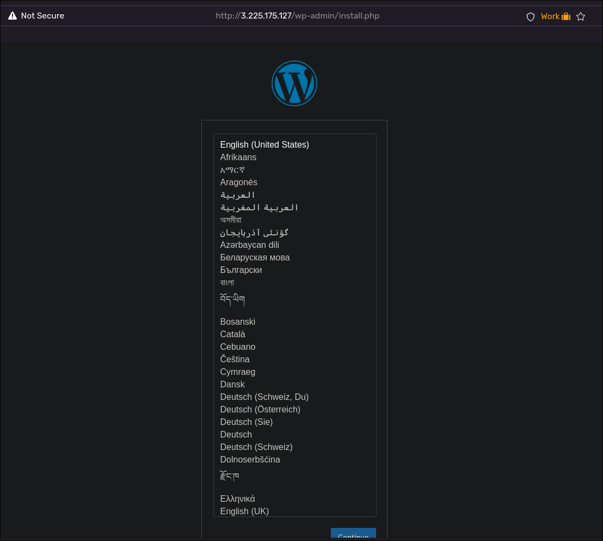
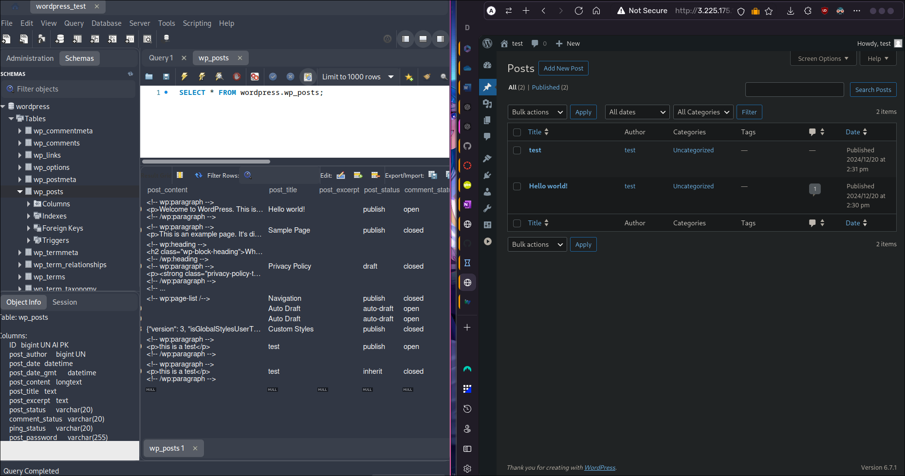
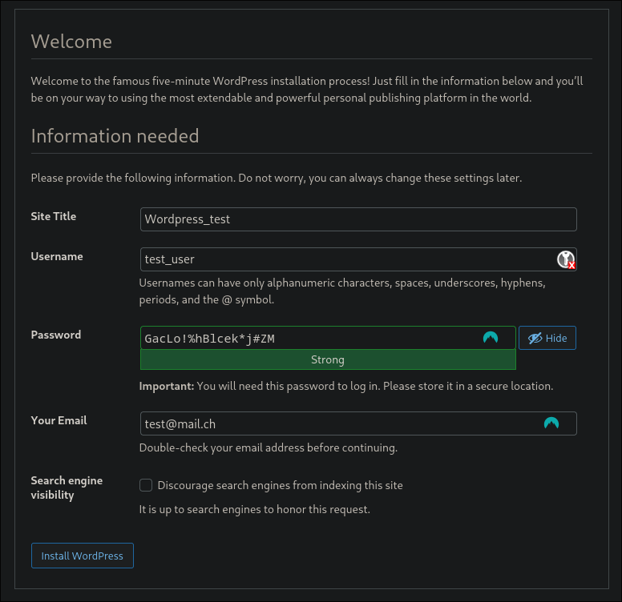
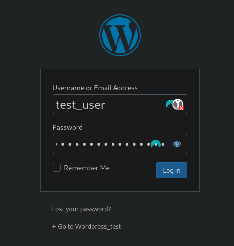
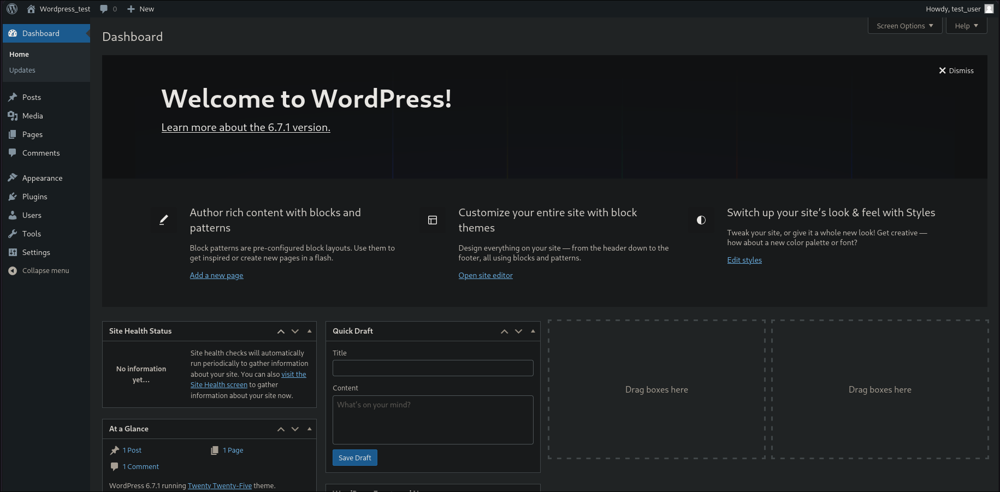

# WordPress auf AWS EC2 – Setup-Anleitung
 
[](https://github.com/arkaizn)
[](https://github.com/dka-stat)
[](https://github.com/josi-git)
[](https://github.com/JoSi-git/m346/blob/main/LICENSE)
 
 
## 📜 Überblick
 
Diese Anleitung beschreibt die Schritte, um eine WordPress-Installation in der Amazon Web Services (AWS) Cloud bereitzustellen. Alle notwendigen Konfigurationsdateien und Skripte befinden sich in diesem Repository. Mithilfe den unterstehenden Schritten, kann die Installation komplett nachgestellt werden.
 
## 📂 Inhaltsverzeichnis
 
1. [Voraussetzungen](#-voraussetzungen)
2. [Installation](#-installation)
3. [Repository Struktur](#-repository-struktur)
4. [Skript erklärungen](#-skript-erklärungen)
5. [Testfälle](#-testfälle)
6. [FAQ](#-faq)
7. [Reflexion](#-reflexion)
 
## ✅ Voraussetzungen
 
Bevor Sie starten, stellen Sie sicher, dass folgende Anforderungen erfüllt sind:
 
- Ein AWS-Account mit administrativen Berechtigungen.
 
- AWS CLI ist installiert und konfiguriert. 
	* Hilfestellung zur Installation und Konfiguration: [GBSSG Gitlab m364](https://gbssg.gitlab.io/m346/iac-aws-cli/)
 
- Git ist installiert.
 
- Ein Webbrowser für den Zugriff auf die WordPress-Seite.

## 🚀 Installation
 
### 1. Repository klonen
 
Klonen Sie dieses Repository auf Ihren lokalen Rechner:
 
```bash
git clone https://github.com/JoSi-git/m346.git
 
cd <pfad-zum-repository>
```
 
Ausführberechtigungen anpassen:
 
```bash
chmod +x install.sh
```

Script ausführen:

```bash
./install.sh
```


## 📂 Repository Struktur
### 🌱 Root-Verzeichnis des Repositories

Beinhaltet das Install.sh /uninstall.sh Script sowie die Dokumentation und alle git Dateien.

- **install.sh:** Ein zentrales Installationsskript, das mehrere der oben genannten Skripte zusammenführt und ausführt.

- **uninstall.sh:** Ein Skript zum Löschen aller Instanzen, Dateien und Ressourcen.  

### 🛠️ 1. Ordner config_files  
 
Beinhaltet folgende Bash-Skripte zur Automatisierung von Aufgaben:
 
- **mysqlinstall.sh:** Skript zur Installation/Konfiguration von MySQL.  
 
- **wpinstall.sh:** Skript zur Installation/Einrichtung von WordPress.

### ⚙️ 2. Ordner Scripts  
 
Beinhaltet verschiedene Shell-Skripte zur Automatisierung von Aufgaben. Beispiele sind:  
 
- **elastic-ip.sh:** Bezieht sich auf die Verwaltung einer Elastic IP.  
 
- **initialize-mysql-instance.sh** & **initialize-web-instance.sh:** Skripte zur Initialisierung von MySQL-Datenbankinstanzen und Webserver-Instanzen.


## 📜 Funktion und Aufgabe der Scripts 

### install.sh

1. Ruft **initialize-mysql-instance.sh** zur Installation des MySQL-Servers auf.
2. Ruft **initialize-web-instance.sh** zur Installation des Webservers auf.
3. Ruft **elastic-ip.sh** zur Initialisierung der Elastic-IP auf.

### variables.sh
 
**User Variablen (veränderbar):**

    SLEEP_DURATION=20
    KEY_NAME=djs-key
    SEC_GROUP_NAME=djs-sec-group
	DB_NAME=wordpress
	DB_USER=wp-user
	DB_PASSWORD=Riethuesli2024_DJS
	
**Script Variablen (unveränderbar)**:
	
	CONFIG_STEP=1
	INSTANCE_ID1=i-03238f46b952c0978
	PUBLIC_IP1="35.169.10.50"
	MySQL_installation_File="./config_files/mysqlinstall.sh"
	INSTANCE_ID2=i-0091e12fea4f1a1a8
	PUBLIC_IP2="44.193.145.66"

### mysqlinstall.sh  
 
1. Update der Paketliste
3. MySQL-Server Installation mit allen abhängigkeiten
3. Start des MySQL-Dienstes
### wpinstall.sh  
 
1. Paketliste aktualisieren
2. Apache2 installieren
3. Apache-Dienst starten und aktivieren
4. PHP und MySQL-Unterstützung installieren
5. MySQL-Client installieren und Verbindung prüfen
6. WordPress herunterladen und vorbereiten
7. WordPress mithilfe **wp-config.php** konfigurieren
8. Anpassen des DocumentRoot und Entfernen der Standardseite.
9. Neustart des Apache-Dienstes, um alle Änderungen zu übernehmen.

### uninstall.sh

1. Instanzen mit **`$SEC_GROUP_NAME`** beenden.
2. Sicherheitsgruppe, Key Pair **`$KEY_NAME`** und Elastic IPs löschen.
3. **`variables.sh`** löschen und neu mit Standardwerten erstellen.

### elastic-ip.sh  

1. Automatisierung der Elastic IP Zuweisung
2. Verhindert redundante Konfigurationen mit **`CONFIG_STEP`**
3. Aktualisiert Konfigurationsdatei für öffentliche IPs

### initialize-mysql-instance.sh

1. Verzeichnis und MySQL-Installationsskript prüfen
2. EC2-Instanz starten und Initialisierung abwarten
3. MySQL-Installationsskript übertragen und ausführen
4. Instanzinformationen ausgeben und Konfigurationsdatei aktualisieren

### initialize-web-instance.sh

1. Verzeichnis erstellen und Web-Installationsskript prüfen
2. EC2-Instanz starten und IP ermitteln
3. Initialisierung abwarten
4. Web-Installationsskript übertragen und ausführen
5. Instanzinformationen ausgeben und Konfigurationsdatei aktualisieren

### sec-key.sh

1. Key Pair erstellen und lokal speichern
2. Sicherheitsgruppe mit HTTP- und SSH-Regeln erstellen


## 🚀 Testfälle

### Test 1: Installation und Konfiguration der WordPress-Instanz

**Testzeitpunkt:** 15:15 Freitag 20/12/24

**Testperson:** Silas Gubler

**Spezifische Informationen:**
- **AWS-Instanz:** t2.micro in der Region us-east-1
- **WordPress-Version:** 6.7 »Rollins«
- **Konfiguration:** Standard-WordPress-Einstellungen

#### Testergebnisse: 

**Ergebnis:** Die WordPress-Instanz wurde erfolgreich installiert.

**Screenshot:**
*Abbildung 1: Zugriff auf Installierte Wordpress Instanz

**Fazit:**  
Die Installation der WordPress-Instanz auf der AWS-Instanz (t2.micro) in der Region us-east-1 verlief ohne Fehler. Das Dashboard ist erreichbar und alle Grundfunktionen sind einsatzbereit. Vor der Produktivsetzung sollten jedoch Sicherheitsupdates angewendet und Standard-Admin-Einstellungen angepasst werden.

**Empfehlung:** Sicherstellen, dass alle Sicherheitsupdates vor der Produktivsetzung angewendet werden.

---
### Test 2: Verbindung zwischen WordPress und MySQL-Server

**Testzeitpunkt:** 15:39 Freitag 20/12/24

**Testperson:** Silas Gubler

**Spezifische Informationen:** Die MySQL-Datenbank wurde mit den in der Variablen-Datei angegebenen Werten konfiguriert.

#### Testergebnisse:

**Ergebnis:** Die Verbindung zwischen WordPress und MySQL war stabil und konnte ohne Probleme eingerichtet werden.

**Screenshot:**

  
*Abbildung 2:* Zugriff auf die Verknüpfte MySQL Datenbank

**Fazit:**  
Die Verbindung zur AWS-Instanz ist stabil, ohne Verbindungsabbrüche. Die Datenbankabfragen in MySQL Workbench werden zuverlässig angezeigt. Insgesamt läuft alles reibungslos und die Infrastruktur ist gut auf die nächsten Schritte vorbereitet.

**Empfehlung:** Regelmässige Backups der MySQL-Datenbank erstellen, um Datenverlust zu vermeiden.

---
### Test 3: Funktionalität des WordPress-Logins

**Testzeitpunkt:** 15:54 Freitag 20/12/24

**Testperson:** Silas Gubler

**Spezifische Informationen:** Test der WordPress-Login-Funktion mit einem Admin-Benutzer, um sicherzustellen, dass der Zugriff korrekt funktioniert.

#### Testergebnisse:

**Ergebnis:** Der Login war erfolgreich, der Admin-Bereich konnte ohne Probleme aufgerufen werden.

**Screenshots:**

  
*Abbildung 3: Konfiguration Admin Benutzer

  
*Abbildung 4: Anmeldung am Wordpress Verwaltungsdashboard*

  
*Abbildung 5: Wordpress Admin Dashboard*

**Fazit:**  
Die Login-Funktion von WordPress funktioniert einwandfrei. Der Anmeldeprozess läuft schnell und problemlos. Ab sofort wird beim Aufrufen der Webseite das Standard-Theme "Twenty Twenty-Five" angezeigt.

**Empfehlung:** Keine weiteren Massnahmen erforderlich, da der Test erfolgreich war.


## ❓ FAQ
### Problem: AWS Zugriff wird abgebrochen

**Fehlermeldung:**
 ```bash #Fehlermeldung Zugriffsfehler
An error occurred (UnauthorizedOperation) when calling the CreateSecurityGroup operation: You are not authorized to perform this operation. 
```

**Problemlösung**:

Das Problem tritt dann auf wen AWS (Learner Lab) ist nicht gestartet oder die AWS Cli Crednetials sind falsch oder abgelaufen sind.
- AWS Starten und die Credentials aktualliseren
- optional: Delete script ausführen um altresten zu bereinigen

---

### Problem:  Ungültiger SSH-Key

**Fehlermeldung:**
 ```bash #Fehlermeldung Ungültiger SSH-Key
An error occurred (InvalidKeyPair.NotFound) when calling the RunInstances operation: The key pair 'djs-key' does not exist

```

**Problemlösung**:

Das Problem tritt dann auf wen weder Install noch uninstall Script den bestehenden Key erkennen und diesen weder ändern noch löschen können.
- Key Manuel aus dem verzeichnis ***~/.ssh*** löschen

---

### Problem: Fehler beim kopieren von Scripts auf die Instanz

**Fehlermeldung:**
 ```bash #Fehlermeldung Ungültiger SSH-Key
ssh: connect to host 184.73.13.156 port 22: Connection refused scp: Connection closed

ssh: connect to host 184.73.13.156 port 22: Connection refused scp: Connection Timed out
```

**Problemlösung**:

AWS mindert bei hohem Aufkommen die Ressourcen des Learner Lab. Dies führt dazu, dass Latenzen extrem unterschiedlich sind. Da dies auch als Nutzer nicht beeinflusst werden kann, gibt es eine Workaround-Variable.

Die Variable **SLEEP_DURATION="20"** in der Datei **variables.sh** definiert die Länge, in der das Script wartet, bis die Instanz hochgefahren ist. Diese ist standardmässig auf 20 Sekunden eingestellt, kann aber für folgende Situationen angepasst werden:

**Connection refused scp: Connection closed:** Sekundenzahl erhöhen 

**Connection refused scp: Connection Timed out:** Sekundenzahl reduzieren

---

### Wie ändere ich Variablen im Script?

Alle globalen Variablen sind im Script variables.sh zentraliert. Im Script können gemütlich dan Usernames, Passwörter, Grupennamen etc. geändert werden (Siehe [variables.sh](#variablessh)).

Sollen die eigens ausgewähleten Namen und Passwörter auch über wiederholende Installationen beibehalten werden, müssen diese auch im **Uninstall.sh** Script auf den Linien **75 - 86** hinzugefügt werden.


## 📖 Reflexion 
### 💡 [Jonas Sieber](https://github.com/josi-git "Jonas Sieber's GitHub Profile")

Ich habe das Projekt als sehr lehrreich empfunden, besonders die Arbeit mit Git war für mich ein echtes Highlight. Ich fand es spannend, mehr über die verschiedenen Funktionen zu lernen und sie direkt im Team anzuwenden. Vor dem Projekt war das Thema Cloud für mich schwer greifbar, und ich hatte überhaupt keinen Ansatz für die praktische Umsetzung. Durch dieses Projekt hat sich das jedoch stark geändert, und ich konnte die Vorteile der Cloud besser verstehen und schätzen lernen.

Auch die Erstellung der Dokumentation in Markdown hat mir gut gefallen. Es war eine neue Erfahrung, die mir gezeigt hat, wie nützlich und vielseitig Markdown ist. Insgesamt bin ich froh, dass wir die Möglichkeit hatten, so viele interessante Themen zu bearbeiten und dabei viel zu lernen.

### 💭 [David Kästli](https://github.com/dka-stat "David Kästli's GitHub Profile")
 
Dieses Projekt war eine sehr bereichernde Erfahrung. Wir hatten die Gelegenheit, uns intensiv mit Themen wie Git und WordPress auseinanderzusetzen und dabei sowohl technische als auch methodische Fähigkeiten zu erweitern. Besonders wertvoll war die
Teamarbeit:
Gemeinsam haben wir neues Wissen aufgebaut, Herausforderungen gemeistert und voneinander gelernt. Ich bin sehr zufrieden mit unserem Endprodukt. Es spiegelt die harte Arbeit und den Einsatz wider, den wir investiert haben.
 
### ✨ [Silas Gubler](https://github.com/arkaizn "Silas Gubler's GitHub Profile")
 
 Ich fand es echt spannend, im Projekt mit der zentralen Speicherung von Variablen zu arbeiten. Dadurch war es viel einfacher, einheitliche Werte in allen Scripts zu nutzen, was die ganze Arbeit effizienter gemacht hat. Besonders cool war, dass wir die Instanzen auf AWS so anpassen konnten, dass sie gut miteinander zusammenarbeiteten.
Die Herausforderungen lagen vor allem in der Synchronisation der IaC-Dateien und der Sicherheit. Aber durch gutes Teamwork haben wir das gut hinbekommen. Insgesamt habe ich viel gelernt, vor allem über Cloud-Management und Automatisierung, und bin zufrieden mit dem Ergebnis.